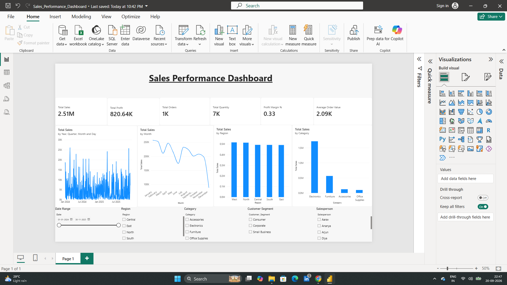

# Sales Performance Dashboard using Microsoft Power BI

## Project Overview

An interactive Microsoft Power BI dashboard designed to analyze sales performance across time, regions, product categories, customer segments, and salespersons.

The dashboard provides KPI monitoring, trend analysis, regional and category-level performance analysis, and interactive filtering to support data-driven decision-making.

> **Portfolio reconstruction:** This project is a portfolio reconstruction based on the project scope described on my resume. The underlying dataset is synthetic and intended for demonstration and learning.

## Dashboard Preview



## Key Features

* Interactive sales performance dashboard
* KPI cards for Total Sales, Total Profit, Total Orders, Total Quantity, Profit Margin, and Average Order Value
* Monthly sales trend analysis
* Sales analysis by region
* Sales analysis by product category
* Interactive filters for date, region, category, customer segment, and salesperson
* DAX-based business metrics and calculations
* Data preparation and transformation using Power BI

## KPIs

| KPI                 | Description                     |
| ------------------- | ------------------------------- |
| Total Sales         | Total revenue generated         |
| Total Profit        | Total profit generated          |
| Total Orders        | Number of unique orders         |
| Total Quantity      | Total quantity sold             |
| Profit Margin %     | Profit as a percentage of sales |
| Average Order Value | Average sales value per order   |

## Tools & Technologies

* Microsoft Power BI
* DAX
* Microsoft Excel / CSV
* Data Analysis
* Data Visualization

## Project Structure

```text
sales-performance-dashboard-powerbi/
├── data/
│   ├── date_dimension.csv
│   └── sales_data.csv
├── docs/
│   ├── dax_measures.txt
│   └── powerbi_build_guide.md
├── screenshots/
│   └── executive-overview.png
├── Sales_Performance_Dashboard.pbix
└── README.md
```

## DAX Measures

The project includes DAX measures for:

* Total Sales
* Total Profit
* Total Cost
* Total Quantity
* Total Orders
* Average Order Value
* Profit Margin %
* Average Selling Price
* Sales YoY %
* Profit YoY %
* Product Sales Rank

Detailed formulas are available in [`docs/dax_measures.txt`](docs/dax_measures.txt).

## Dataset

The project uses a synthetic sales dataset created for portfolio demonstration and learning purposes.

The dataset contains transaction-level information used to analyze:

* Sales
* Profit
* Cost
* Quantity
* Orders
* Products
* Categories
* Regions
* Customer Segments
* Salespersons

## How to Use

1. Download `Sales_Performance_Dashboard.pbix`.
2. Open the file using Microsoft Power BI Desktop.
3. Review the dashboard and interact with the available slicers.
4. Use the included CSV files and DAX documentation to understand the data model and calculations.

## Skills Demonstrated

* Power BI Dashboard Development
* Data Analysis
* Data Visualization
* DAX
* KPI Development
* Business Reporting
* Interactive Filtering
* Analytical Problem Solving
